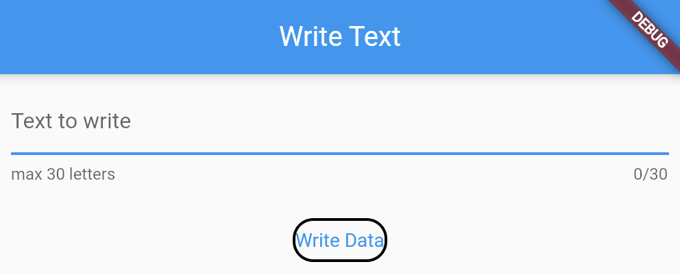

# Write and Read File on Flutter App

## Import writeData.dart and use it as the example of the main.dart

Write and erase the same data into a file

    await globalWrite.writeData(filename, data);

Read data as List<String>

    data.split(";")
    
Write in the final of the document separated with a ";" symbol

    void writeData() async {
        data = await globalWrite.readData(filename);
        data = data + controllerWriteData.text + ";";
        await globalWrite.writeData(filename, data);
        setState(() {});
    }

Refresh Data

    void readDataNow() async {
        data = await globalWrite.readData(filename);
        setState(() {});
      }
      
Start App Reading a FileText

    @override
      void initState() {
        super.initState();
        readDataNow();
    }
